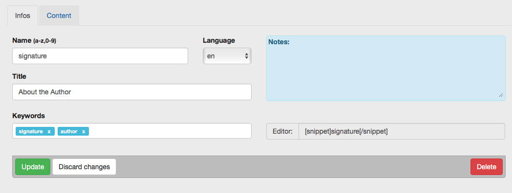
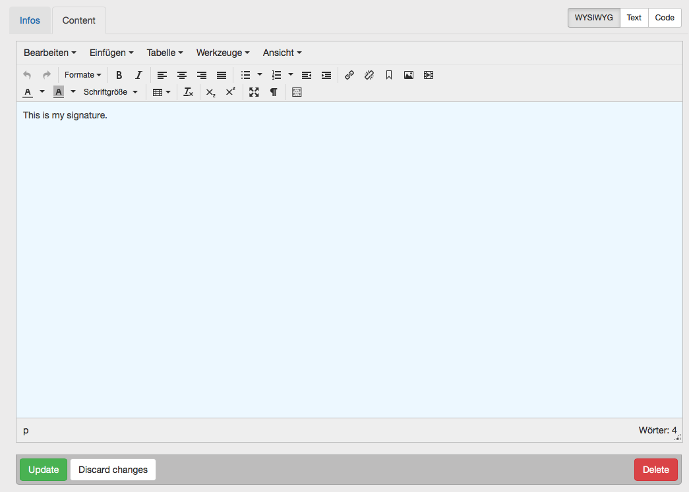

# Snippets

If you need certain text phrases more than once, you can store this as a snippet.
These can be found at ACP > Sites > Snippets.

The WYSIWYG editor can be turned off here. This is useful if you want to store complex HTML Code.

Include the snippet's Content by the snippet short code. In this example, the snippet is named "signature".

<code>[snippet]signature[/snippet]</code>

Also in the templates snippets can be used. Use the Prefix `$fc_snippet_*`.
```
/* snippet name: signature */
$fc_snippet_signature
```

<div class="thumb">

Informations about your Snippet
</div>

<div class="thumb">

The Content of your Snippet. On the top right you see the Toggle Buttons to turn off the WYSIWYG Editor.
</div>